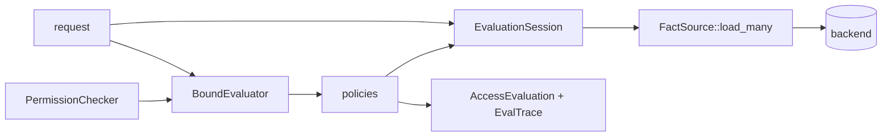
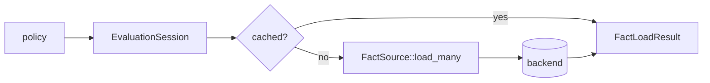

# Gatehouse

[](https://github.com/thepartly/gatehouse/actions/workflows/ci.yml) [](https://crates.io/crates/gatehouse) [](https://docs.rs/gatehouse)

An in-process authorization engine for Rust. Gatehouse keeps policy logic in Rust while giving each request an `EvaluationSession` for relationship and backend-loaded facts. Sessions batch, deduplicate, cache, and coalesce fact loads, so list endpoints can stay policy-correct without pushing authorization logic into the data layer.


## Features

- **Typed authorization domains**: Define one `PolicyDomain` per authorization domain and keep subject, action, resource, and context types consistent.
- **Request-bound evaluation**: Bind session, subject, action, and context once, then call `check`, `evaluate`, `evaluate_by`, `filter`, `filter_by`, or `lookup_page`.
- **RBAC, ReBAC, and predicate policies**: Use `RbacPolicy`, `RebacPolicy`, or synchronous `PolicyBuilder::when` predicates.
- **Deny-overrides semantics**: `PolicyBuilder::forbid()` and custom forbid results veto grants, including through combinators and delegation.
- **Batch-safe list endpoints**: Authorize already-loaded resources or enumerate candidate IDs with `LookupSource` and `Hydrator`.
- **Evaluation traces and telemetry**: Inspect the policies and fact provenance that were actually evaluated.

## Quick Start

```rust
use gatehouse::*;

#[derive(Debug, Clone)]
struct User {
    id: u64,
    roles: Vec<&'static str>,
}

#[derive(Debug, Clone)]
struct Document {
    owner_id: u64,
}

#[derive(Debug, Clone)]
struct ReadAction;

struct Documents;
impl PolicyDomain for Documents {
    type Subject = User;
    type Action = ReadAction;
    type Resource = Document;
    type Context = ();
}

let admin_policy = PolicyBuilder::<Documents>::new("AdminOnly")
    .subjects(|user: &User| user.roles.contains(&"admin"))
    .build();

let owner_policy = PolicyBuilder::<Documents>::new("OwnerOnly")
    .when(|user: &User, _action: &ReadAction, doc: &Document, _ctx: &()| {
        user.id == doc.owner_id
    })
    .build();

let mut checker = PermissionChecker::<Documents>::new();
checker.add_policy(admin_policy);
checker.add_policy(owner_policy);

# tokio_test::block_on(async {
let session = EvaluationSession::empty();
let action = ReadAction;
let document = Document { owner_id: 7 };

let admin = User { id: 1, roles: vec!["admin"] };
let owner = User { id: 7, roles: vec!["user"] };
let guest = User { id: 2, roles: vec!["user"] };

assert!(checker.bind(&session, &admin, &action, &()).check(&document).await.is_granted());
assert!(checker.bind(&session, &owner, &action, &()).check(&document).await.is_granted());
assert!(!checker.bind(&session, &guest, &action, &()).check(&document).await.is_granted());
# });
```

Use `EvaluationSession::empty()` for fact-free checkers. When any policy reads facts through `ctx.session.get(...)`, build a `FactRegistry` at application setup and create a fresh `registry.session()` for each request.

## Core Flow

Most call sites bind request-wide inputs once and evaluate one or more resources through the bound evaluator:

```rust,ignore
let session = registry.session();
let bound = checker.bind(&session, &subject, &action, &request_context);

let decision = bound.check(&resource).await;
let decisions = bound.evaluate(resources.clone()).await;
let authorized = bound.filter(resources).await;
let authorized_rows = bound.filter_by(rows, |row| &row.authz_resource).await;
let page = bound.lookup_page(&lookup, &hydrator, cursor.as_deref(), limit).await?;
```



`BoundEvaluator::evaluate` preserves input order and returns one `AccessEvaluation` per resource. `BoundEvaluator::filter` keeps only granted resources. Use `evaluate_by` and `filter_by` when the caller owns wider rows and authorization should project each row to an embedded resource. The returned values are still the original rows. `BoundEvaluator::lookup_page` is for list endpoints where the application cannot load every possible candidate first; a `LookupSource` enumerates candidate IDs, a `Hydrator` resolves them, and the full policy stack authorizes the hydrated resources.

## Decision Semantics

- `PermissionChecker` applies fixed deny-overrides semantics: any evaluated result containing `PolicyEvalResult::Forbidden` denies; otherwise the first grant wins.
- Policies declaring `Effect::Forbid` or `Effect::AllowOrForbid` are evaluated before allow-only policies, so a veto cannot be skipped by grant short-circuiting.
- If nothing grants, the checker denies with `"All policies denied access"`.
- An empty checker denies with `"No policies configured"`.
- `PolicyEvalResult::NotApplicable` means the policy did not grant. `PolicyEvalResult::Forbidden` means the policy actively vetoed.
- `PolicyBuilder` combines configured predicates with AND logic. `PolicyBuilder::forbid()` makes a matching policy forbid; a non-match remains not applicable and does not block.
- `AndPolicy` and `OrPolicy` evaluate veto-capable children before allow-only children, then short-circuit normally. `NotPolicy` inverts grants and non-grants, but never turns `Forbidden` into a grant.
- `Forbidden` propagates through `AndPolicy`, `OrPolicy`, `NotPolicy`, and `DelegatingPolicy`.
- `not()` does not neutralize a veto: `admin.or(blocked.not())` still denies if `blocked` returns `Forbidden`. For "grant unless blocked", make `blocked` an allow-only predicate and wrap that in `not()`, or register a direct forbid policy when the block should be global.

Denials from `AccessEvaluation` are summary-level. Use `AccessEvaluation::display_trace()` or the attached `EvalTrace` to inspect individual policy reasons and fact provenance.

## Policy Domains

A `PolicyDomain` names the four types involved in one authorization domain:

```rust
use gatehouse::PolicyDomain;

# struct User;
# struct DocAction;
# struct Document;
# struct RequestContext;
struct Documents;

impl PolicyDomain for Documents {
    type Subject = User;
    type Action = DocAction;
    type Resource = Document;
    type Context = RequestContext;
}
```

The generic parameter then stays short and consistent:

```rust,ignore
let policy = PolicyBuilder::<Documents>::new("Owner")
    .when(|user, _action, doc, _ctx| user.id == doc.owner_id)
    .build();

let checker = PermissionChecker::<Documents>::new();
```

## PolicyBuilder

Use `PolicyBuilder` for synchronous predicate logic:

```rust,ignore
let suspended_account = PolicyBuilder::<Documents>::new("SuspendedAccount")
    .when(|user, _action, _doc, _ctx| user.is_suspended)
    .forbid()
    .build();
```

Reach for a direct `Policy<D>` implementation when a rule needs async work, custom batching, custom telemetry metadata, or hand-written forbid behavior.

```rust
use async_trait::async_trait;
use gatehouse::{EvalCtx, Policy, PolicyDomain, PolicyEvalResult};
use std::borrow::Cow;

# #[derive(Debug, Clone)]
# struct User { id: u64 }
# #[derive(Debug, Clone)]
# struct Document { owner_id: u64 }
# #[derive(Debug, Clone)]
# struct ReadAction;
# struct Documents;
# impl PolicyDomain for Documents {
#     type Subject = User;
#     type Action = ReadAction;
#     type Resource = Document;
#     type Context = ();
# }
struct OwnerPolicy;

#[async_trait]
impl Policy<Documents> for OwnerPolicy {
    async fn evaluate(&self, ctx: &EvalCtx<'_, Documents>) -> PolicyEvalResult {
        if ctx.subject.id == ctx.resource.owner_id {
            ctx.grant("subject owns the document")
        } else {
            ctx.not_applicable("subject does not own the document")
        }
    }

    fn policy_type(&self) -> Cow<'static, str> {
        Cow::Borrowed("OwnerPolicy")
    }
}
```

## Built-In Policies

- `RbacPolicy`: role-based access control. Grants when at least one required role for `(action, resource)` is present in the subject's roles.
- `RebacPolicy`: relationship-based access control. Extracts subject/resource IDs, builds `RelationshipQuery` keys, and grants when the request session loads `Found(true)` from a registered `FactSource`.
- `DelegatingPolicy`: maps inputs into another `PolicyDomain` and delegates to a child `PermissionChecker` while preserving batching and trace shape.

Use `PolicyBuilder::when` for attribute-style predicates that compare subject, action, resource, and context in one closure.

## Fluent Combinators

Policies can be composed with the `PolicyExt` helpers:

```rust,ignore
use gatehouse::PolicyExt;

let rule = is_editor.and(not_locked.not()).or(admin_override);
checker.add_policy(rule);
```

`AndPolicy::try_new`, `OrPolicy::try_new`, and `NotPolicy::new` remain available when constructing policies from dynamic collections.

`forbid()` creates a global veto, not a local negative predicate. In particular, `grant.and(forbid_only)` can never grant because the forbid-only child never satisfies AND's "all children grant" rule. For a local exclusion, build the blocked condition as an ordinary allow-style predicate and compose `grant.and(blocked.not())`.

## Request-Scoped Facts

`FactSource::load_many` receives unique keys and must return exactly one result per key in the same order. `EvaluationSession` expands duplicate caller inputs, preserves caller order, caches results for the request, chunks loads according to `FactSource::max_batch_size`, and joins concurrent in-flight loads for the same key.



`RebacPolicy` is the built-in fact-backed policy. Missing sources, missing facts, backend errors, and source contract violations fail closed to denied ReBAC decisions.

Use typed relation enums when the domain has a fixed relation set, even if the backing store uses strings. The `FactSource` owns the backend boundary and can convert `Relation::Viewer` to `"viewer"` when binding SQL parameters.

## List Endpoints

For lists where the application already has candidate resources, use `BoundEvaluator::filter`:

```rust,ignore
let session = registry.session();
let visible_posts = checker
    .bind(&session, &user, &PostAction::View, &request_context)
    .filter(posts)
    .await;
```

If each item is a wide row and the authorization resource is a projection, use the extractor variants:

```rust,ignore
let visible_rows = checker
    .bind(&session, &user, &InvoiceAction::View, &request_context)
    .filter_by(rows, |row| &row.authz_resource)
    .await;
```

For lists where the candidate set is too large to load first, implement `LookupSource<Domain>` and `Hydrator<Id>`:

```rust,ignore
let page = checker
    .bind(&session, &user, &PostAction::View, &request_context)
    .lookup_page(&lookup, &hydrator, cursor.as_deref(), limit)
    .await?;
```

A `LookupSource` must enumerate a superset of every resource that any policy could grant for the bound subject/action/context. Lookup narrows candidates; it does not replace the policy stack.

## Long-Lived Streams

`EvaluationSession` caches are scoped to one authorization pass. For SSE, WebSocket, and other long-lived streams, do not keep one fact-backed session for the stream lifetime.

If your product contract authorizes once at stream open, create a fresh session, compute the visible ID set with `filter` / `filter_by`, drop the session, and only emit frames for that set. If the stream must observe mid-stream permission revocation, run periodic reauthorization with a fresh `registry.session()` each tick and re-bind the checker for that pass.

## Tracing And Telemetry

When trace-level events are enabled, checker evaluation records spans for single-resource and batch evaluation, and each evaluated policy records a `trace!` event on the `gatehouse::security` target. Batch evaluation records aggregate item counts and nested `gatehouse.batch_policy` spans with per-policy counts.

Reason strings are emitted verbatim. Keep credentials, tokens, raw PII, and other sensitive material out of policy reasons and fact provenance details. Enable the optional `serde` feature to serialize `AccessEvaluation`, `EvalTrace`, `PolicyEvalResult`, and fact provenance for audit logs.

Security event fields:

- `security_rule.name`
- `security_rule.category`
- `security_rule.description`
- `security_rule.reference`
- `security_rule.ruleset.name`
- `security_rule.uuid`
- `security_rule.version`
- `security_rule.license`
- `event.outcome`
- `policy.type`
- `policy.result.reason`

## Examples

Run a self-contained example with:

```shell
cargo run --example rbac_policy
```

Run a server example with:

```shell
cargo run --example axum
```

Then send requests to `http://127.0.0.1:8000`; `actix_web` listens on `http://127.0.0.1:8080`.

Examples to start with:

- `rbac_policy`: basic role-based access control.
- `policy_builder`: attribute-style custom policies.
- `combinator_policy`: fluent `and` / `or` / `not` composition.
- `deny_override`: global veto policies with `PolicyBuilder::forbid()`.
- `delegating_policy`: cross-domain checks with `DelegatingPolicy`.
- `mfa_freshness_context`: request-scoped context inputs.
- `rebac_policy`: relationship checks through `FactSource`.
- `in_ram_rebac`: in-memory relationship facts and session caching.
- `lookup_in_ram`: `LookupSource` plus `Hydrator` list authorization.
- `factsource_n_plus_one`: why request-scoped facts matter for list endpoints.
- `axum` and `actix_web`: web-framework integration.
- `postgres_bulk_rebac`: SQL-backed ReBAC fact loading.

## Performance

Criterion benchmarks in `benches/permission_checker.rs` exercise bound checker evaluation, fact loading, batching, and policy-builder batch shortcuts. Run them with:

```shell
cargo bench
```

The `postgres_bulk_rebac` example demonstrates a SQL-backed ReBAC `FactSource` with one batched `WITH ORDINALITY` query per request. It expects a live PostgreSQL database and reads `DATABASE_URL`.
