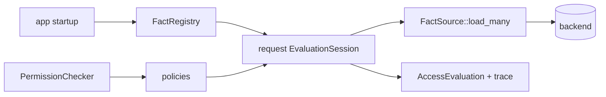

# Gatehouse

[](https://github.com/thepartly/gatehouse/actions/workflows/ci.yml)
[](https://crates.io/crates/gatehouse)
[](https://docs.rs/gatehouse)

An in-process authorization engine for Rust. Compose RBAC, ReBAC, and ABAC-style predicates while
loading relationship facts through request-scoped sessions that batch, deduplicate, and coalesce
backend calls. List endpoints stay correct and fast without pushing policy into your data layer.


## Features

- **In-process authorization**: Keep policy logic in Rust without requiring a separate authorization
  service
- **Multi-paradigm policies**: Compose RBAC, ReBAC, and ABAC-style `PolicyBuilder` predicates
- **Request-scoped fact loading**: Load relationship facts through `EvaluationSession` and
  `FactSource`
- **Batch-safe list endpoints**: Authorize many resources with policy-correct batching,
  deduplication, and caller-order preservation
- **Policy Composition**: Combine policies with logical operators (`AND`, `OR`, `NOT`)
- **Detailed Evaluation Tracing**: Decision trace for the policies and branches that were actually
  evaluated
- **Fluent Builder API**: Construct custom policies with a PolicyBuilder.
- **Type Safety**: Strongly typed resources/actions/contexts
- **Async Ready**: Built with async/await support

## Quick Start

```rust
use gatehouse::*;

#[derive(Debug, Clone)]
struct User {
    id: u64,
    roles: Vec<String>,
}

#[derive(Debug, Clone)]
struct Document {
    owner_id: u64,
}

#[derive(Debug, Clone)]
struct Action;

#[derive(Debug, Clone)]
struct Context;

let admin_policy = PolicyBuilder::<User, Action, Document, Context>::new("AdminOnly")
    .subjects(|user| user.roles.iter().any(|role| role == "admin"))
    .build();

let owner_policy = PolicyBuilder::<User, Action, Document, Context>::new("OwnerOnly")
    .when(|user, _action, resource, _ctx| resource.owner_id == user.id)
    .build();

let mut checker = PermissionChecker::new();
checker.add_policy(admin_policy);
checker.add_policy(owner_policy);

# tokio_test::block_on(async {
let user = User {
    id: 1,
    roles: vec!["admin".to_string()],
};
let document = Document { owner_id: 1 };

// `check` is the everyday call for fact-free checkers. Reach for
// `evaluate_in_session` when the checker has any fact-backed policy.
let evaluation = checker.check(&user, &Action, &document, &Context).await;

assert!(evaluation.is_granted());
println!("{}", evaluation.display_trace());

let outcome: Result<(), String> = evaluation.to_result(|reason| reason.to_string());
assert!(outcome.is_ok());
# });
```

For checkers with any fact-backed policy (ReBAC or custom `FactSource`-using policies), build a
`FactRegistry` at application setup, create an `EvaluationSession` per request with
`registry.session()`, and call `checker.evaluate_in_session(&session, …)` or the matching
batch/list API.

## Which API should I use?

Three workflows cover most call sites:

```text
single resource
  subject + action + resource + context
      -> check / evaluate_in_session
      -> AccessEvaluation

already-loaded candidates
  Vec<item>
      -> evaluate_batch_in_session   (keep every decision)
      -> filter_authorized_in_session (keep only allowed items)

unknown candidate set
  LookupSource -> Hydrator -> lookup_authorized_page
```

Start with `PermissionChecker::check` for ordinary point checks that do not load facts. Use
`PermissionChecker::evaluate_in_session` when any policy reads fact-backed state.

For lists where you already have the candidate resources, use `filter_authorized_in_session` when
you only need the allowed items, or `evaluate_batch_in_session` when you need the full per-item
`AccessEvaluation` trace. Both methods take an item iterator plus a closure that borrows
`(&resource, &context)` from each item.

For lists where the candidate set is too large to load first, use `lookup_authorized_page` with a
`LookupSource` and `Hydrator`.

`check` uses `EvaluationSession::shared_empty()` internally. For ReBAC or any custom policy that
calls `ctx.session.get(...)`, create the request session from a `FactRegistry` and pass it to
`evaluate_in_session` or the corresponding batch API.

## Why Request-Scoped Facts Matter

Simple checks still look like normal Rust predicates. The difference shows up when an endpoint has
to authorize a page, feed, subscription batch, or search result. Without request-scoped fact
loading, those paths either pay N policy evaluations and N backend round trips, or duplicate policy
logic into SQL and risk bypassing later checker policies.

Gatehouse now treats authorization as computation over request-scoped facts. A policy stack can keep
in-memory checks, combinators, and relationship checks in one place, while `EvaluationSession`
batches and caches the fact loads needed by that request.



You do not need to model every check as a fact. RBAC and `PolicyBuilder` predicates stay simple and
in-process; fact sources are the production path for data that would otherwise require per-resource
I/O, such as relationship checks behind list endpoints.

If you are upgrading from 0.2, see `MIGRATION.md` for the `RelationshipResolver` to `FactSource`
migration path and `Policy` trait changes.

## Decision Semantics

- `PermissionChecker` applies fixed **deny-overrides** semantics: any policy that _forbids_ (an
  `Effect::Forbid` policy whose predicate matches) denies the request, overriding every grant;
  otherwise any granting policy grants (`OR`, short-circuiting on the first grant); otherwise the
  request is denied.
- Forbid-effect policies are evaluated before allow policies, so a veto is never skipped by the grant
  short-circuit. Registration order does not change the decision. With no forbid-effect policies,
  behavior is plain `OR`, exactly as before.
- An empty `PermissionChecker` always denies with the reason `"No policies configured"`.
- `AndPolicy` short-circuits on the first non-grant; `OrPolicy` short-circuits on the first grant.
- `NotPolicy` inverts the result of its inner policy.
- Inside combinators a forbid behaves like an ordinary denial: forbids are honored at the checker
  level, not propagated through combinator trees. Register forbidding policies directly on the
  checker; use `AndPolicy[grant, NotPolicy(block)]` for an exclusion scoped to one grant path.
- `PolicyBuilder` combines all configured predicates with `AND` logic.
  `PolicyBuilder::forbid()` makes a matching policy _forbid_ (`PolicyEvalResult::Forbidden`); a
  non-match is "not applicable" and never blocks anything. Hand-written policies that can forbid
  (via `ctx.forbid(...)`) must declare it by overriding `Policy::effect`.
- `AccessEvaluation::Denied.reason` is a summary string: `"Forbidden by <policy>: <reason>"` for a
  veto (also exposed via `AccessEvaluation::forbidden_by()`), `"All policies denied access"`
  otherwise. Inspect the trace tree for individual policy reasons.
- Evaluation traces only contain policies and branches that were actually evaluated before
  short-circuiting, in evaluation order (forbid-effect policies first).

## Core Components

### `Policy` Trait

The foundation of the authorization system:

```rust
use async_trait::async_trait;
use std::borrow::Cow;
use gatehouse::{BatchEvalCtx, Effect, EvalCtx, Policy, PolicyEvalResult, SecurityRuleMetadata};

#[async_trait]
trait Policy<Subject, Action, Resource, Context>: Send + Sync {
    async fn evaluate(&self, ctx: &EvalCtx<'_, Subject, Action, Resource, Context>)
        -> PolicyEvalResult;

    async fn evaluate_batch<'item>(
        &self,
        ctx: &BatchEvalCtx<'item, Subject, Action, Resource, Context>,
    ) -> Vec<PolicyEvalResult>;

    fn policy_type(&self) -> Cow<'static, str>;

    fn effect(&self) -> Effect {
        Effect::Allow
    }

    fn security_rule(&self) -> SecurityRuleMetadata {
        SecurityRuleMetadata::default()
    }
}
```

Within `evaluate`, prefer `ctx.grant("reason")` / `ctx.not_applicable("reason")` / `ctx.forbid("reason")` (and
the `*_with_facts` variants) to build the `PolicyEvalResult` instead of re-passing
`self.policy_type()` — the checker captures the policy name on `EvalCtx` once per evaluation. A
policy that can `forbid` must also override `effect()` to return `Effect::Forbid` so the checker
schedules it ahead of the grant short-circuit.

### `PermissionChecker`

Aggregates multiple policies with deny-overrides semantics: any matching `Effect::Forbid` policy
denies; otherwise, if any policy grants access, permission is granted. The returned
`AccessEvaluation` contains both the final decision and a trace tree of the evaluated policies.

```rust,ignore
let mut checker = PermissionChecker::new();
checker.add_policy(rbac_policy);
checker.add_policy(owner_policy);

// Fact-free path: no fact sources, so `check` is the
// idiomatic call. For fact-backed checkers (ReBAC, lookup), build
// an EvaluationSession per request and use evaluate_in_session.
let evaluation = checker.check(&user, &action, &resource, &context).await;
if evaluation.is_granted() {
    // Access allowed
} else {
    // Access denied
}

println!("{}", evaluation.display_trace());
```

For multi-checker applications where the same policy name might appear in several checkers (an
`Invoice` checker and a `Product` checker both reusing a shared `AdminOverride` policy), construct
each checker with `PermissionChecker::named("InvoiceChecker")`. The name surfaces on the
`gatehouse::security` tracing span as `checker.name`, so audit pipelines can disambiguate the
source.

### Batch Authorization

List and subscription endpoints often need to answer "which of these resources can this subject
access?" Use `evaluate_batch_in_session` when you need the decision for every input item, or
`filter_authorized_in_session` when only the authorized subset matters. Both methods accept any
iterator of caller-owned items and a closure that borrows the resource and context from one item.

```rust
let session = EvaluationSession::empty();
let visible_posts = checker
    .filter_authorized_in_session(
        &session,
        &user,
        &Action::View,
        posts
            .into_iter()
            .map(|post| (post, request_context.clone()))
            .collect::<Vec<_>>(),
        |(post, context)| (post, context),
    )
    .await;
```

The caller keeps ownership of resource loading and context construction. Gatehouse borrows the
resource/context pair from each item, preserves input order, and applies the same per-item
deny-overrides semantics as `evaluate_in_session`.

Policies can override `Policy::evaluate_batch` to collapse backend work. `RebacPolicy` builds
`RelationshipQuery` fact keys and loads them through the request-scoped `EvaluationSession`, so
deduplication, chunking, caching, and fail-closed source errors live in one `FactSource` layer.
Combinator policies (`AndPolicy`, `OrPolicy`, and `NotPolicy`) preserve batching for their inner
policies. `PolicyBuilder`-built policies additionally short-circuit the batch-shared axes
(`.subjects()` / `.actions()`) once per batch instead of once per item — this is specific to
`PolicyBuilder`'s generated `evaluate_batch`; a hand-written `Policy` impl that doesn't override
`evaluate_batch` falls through to the serial-loop default and gets nothing for free.

Checker and combinator batch evaluation remain sequential by design: they preserve policy order,
per-item short-circuiting, and trace shape. Parallel work belongs inside policy implementations or
fact sources today; any future checker-level parallel batch API should be explicit.
`EvaluationSession` is safe to share across those parallel loaders, and unrelated fact keys do not
contend on one global cache or in-flight lock.

`PermissionChecker::with_max_batch_size` caps the number of still-pending items passed to each
policy batch call. Fact-backed policies can also set `FactSource::max_batch_size`, which caps
source-level loads after session deduplication.

```rust
use std::num::NonZeroUsize;

let checker = PermissionChecker::new()
    .with_max_batch_size(NonZeroUsize::new(500).unwrap());
```

### Fact Sources And Sessions

`EvaluationSession` is request-scoped. Build a `FactRegistry` once during application setup, create
a fresh session from that registry for each request, run the checker, then drop the session:

```rust,ignore
let registry = FactRegistry::builder()
    .with_arc::<RelationshipQuery<Uuid, Uuid, Relation>>(Arc::clone(&relationships))
    .build();

let session = registry.session();
```

For hot fact-free paths, `EvaluationSession::shared_empty()` returns a process-wide empty session
and avoids per-call allocation. Only use it when no fact-backed policies are expected.

The source registry is keyed by the exact Rust fact key type. If two backends serve the same logical
key shape, define distinct key/newtype wrappers rather than registering both under one
`RelationshipQuery<...>` type.

#### Cache Lifetime And Revocation

Cached facts, cached errors, and in-flight load state do not outlive the request-scoped session.
This is a correctness boundary as well as a performance detail: if a permission is revoked after one
request has loaded it, a new request builds a new session and must load the fact again.

`FactSource::load_many` receives unique keys and must return exactly one result per key in the same
order. The session handles duplicate expansion and caller-order preservation. Missing sources,
backend errors, missing facts, wrong result counts, and cancelled loader tasks all fail closed.

If the leader task for an in-flight fact load is cancelled or panics, the session caches
`FactLoadError::LoaderCancelled` for those keys and wakes waiters. That intentionally poisons those
keys for the rest of the request-scoped session so the request fails closed instead of hanging.
Build a fresh session for a retry or a new request.

`RebacPolicy` is the first built-in fact-backed policy. It extracts subject/resource IDs, builds
`RelationshipQuery<SubjectId, ResourceId, Relation>` keys, and asks the session for those
relationship facts.

Use a typed relation enum when your domain has a fixed relation set, even if the backing store uses
strings. The `EvaluationSession` deduplicates and caches by the typed `RelationshipQuery`; the
`FactSource` owns the backend boundary and can convert `Relation::Viewer` to `"viewer"` when binding
SQL parameters. The `postgres_bulk_rebac` example demonstrates this pattern against a PostgreSQL
`text` column.

If several relationship domains all look like `Uuid -> Uuid`, prefer one domain relation enum and
dispatch inside the corresponding `FactSource`. If you need separate source registrations, wrap IDs
in domain newtypes so each `RelationshipQuery<SubjectId, ResourceId, Relation>` has a distinct Rust
type.

### PolicyBuilder

The `PolicyBuilder` provides a fluent API to construct custom policies by chaining predicate
functions for subjects, actions, resources, and context. Every configured predicate must pass for
the built policy to grant access. Once built, the policy can be added to a `PermissionChecker`.

Use `PolicyBuilder` for synchronous predicate logic. If your policy needs async I/O or external
lookups, implement `Policy` directly.

```rust,ignore
let custom_policy = PolicyBuilder::<MySubject, MyAction, MyResource, MyContext>::new("CustomPolicy")
    .subjects(|s| /* ... */)
    .actions(|a| /* ... */)
    .resources(|r| /* ... */)
    .context(|c| /* ... */)
    .when(|s, a, r, c| /* ... */)
    .build();
```

### Built-in Policies

- `RbacPolicy`: Role-based access control. Grants when at least one required role for
  `(action, resource)` is present in the subject's roles.
- `RebacPolicy`: Relationship-based access control. Extracts flat subject/resource IDs, builds
  `RelationshipQuery` keys, and grants when the request-scoped `EvaluationSession` loads
  `Found(true)` from a registered `FactSource`.
- `DelegatingPolicy`: Delegates a decision to another `PermissionChecker` after mapping
  parent-domain inputs into child-domain inputs. Batch delegation preserves the child checker's
  batch path and trace.

Use `PolicyBuilder::when` for attribute-style predicates that compare subject, action, resource,
and context in one synchronous closure.

Fact-backed ReBAC failures fail closed: missing sources, missing facts, source errors, and source
contract violations produce denied decisions rather than panics or accidental grants.

### Combinators

- `AndPolicy`: Grants access only if all inner policies allow access. Must be created with at least
  one policy.
- `OrPolicy`: Grants access if any inner policy allows access. Must be created with at least one
  policy.
- `NotPolicy`: Inverts the decision of an inner policy.
- `DelegatingPolicy`: Cross-domain delegation through another checker, useful when one resource's
  access depends on another authorization domain.

## Tracing And Telemetry

When trace-level events are enabled, `PermissionChecker::evaluate_in_session` creates an
instrumented span and every evaluated policy records a `trace!` event on the `gatehouse::security`
target. Batch evaluation records checker-level aggregate fields and nested `gatehouse.batch_policy`
spans with per-policy pending/granted/denied counts.

Span, event target, and field names listed here are public observability API. Renaming or removing
them is treated as a semver-major change.

**Reason strings are emitted verbatim.** The `policy.result.reason` field and
`FactProvenance.detail` rendered inside `EvalTrace::format` carry whatever the policy or fact source
put there. Policies that interpolate subject- or context-derived data into reasons
(`format!("user {} not in {}", subject.email, …)`) will expose that data to every tracing
subscriber, including production log shippers. Treat reason strings as part of the public audit
surface and keep credentials, tokens, raw PII, and other sensitive material out of them.

Span and event names:

- `evaluate_in_session` span for single-item checker evaluation
- `evaluate_batch_in_session` span for batch checker evaluation
- `gatehouse.batch_policy` span for each policy batch pass
- `gatehouse.fact_load` span for each source-level fact load
- `gatehouse::security` target for per-policy security events

Single-item security event fields:

- `security_rule.name`
- `security_rule.category`
- `security_rule.description`
- `security_rule.reference`
- `security_rule.ruleset.name`
- `security_rule.uuid`
- `security_rule.version`
- `security_rule.license`
- `event.outcome`
- `policy.type`
- `policy.result.reason`

Single-item checker span fields:

- `policy_count`
- `outcome`
- `policy.type`

Batch checker span fields:

- `item_count`
- `granted_count`
- `denied_count`
- `policy_count`
- `max_batch_size`

Nested `gatehouse.batch_policy` span fields:

- `policy.type`
- `policy.pending_count`
- `policy.chunk_index`
- `policy.chunk_count`
- `policy.granted_count`
- `policy.denied_count`

`gatehouse.fact_load` span fields:

- `fact.name`
- `fact.load_id`
- `fact.key_count`
- `fact.unique_key_count`

Fallback behavior when `security_rule()` is not overridden:

- `security_rule.name` falls back to `policy_type()`
- `security_rule.category` falls back to `"Access Control"`
- `security_rule.ruleset.name` falls back to `"PermissionChecker"`

## Examples

See the `examples` directory for complete demonstrations. Most examples are self-contained and run
with `cargo run --example <name>`. The web examples start local servers, and `postgres_bulk_rebac`
needs a live PostgreSQL database.

**Start here: policy mechanics**

- `rbac_policy` — basic role-based access control with `PermissionChecker`.
- `policy_builder` — attribute-style custom policies via `PolicyBuilder`.
- `combinator_policy` — combining policies with `AndPolicy` / `OrPolicy` / `NotPolicy`.
- `deny_override` — "deny overrides allow" with `Effect::Forbid` policies (account suspensions, legal
  holds) registered flat on the checker, plus the `AndPolicy[grant, NotPolicy(block)]` shape for
  exclusions scoped to a single grant path.
- `delegating_policy` — defer a decision to another domain's `PermissionChecker` with
  `DelegatingPolicy` (comment moderation inheriting document edit rights), keeping the trace across
  the boundary.
- `mfa_freshness_context` — when (and when not) to populate the `Context` generic, grounded in a
  high-value-refund / MFA-freshness decision. Also shows the hand-written deny-policy shape:
  `ctx.forbid(...)` plus an `effect()` override, registered flat on the checker.

**Then learn request-scoped facts and list endpoints**

- `factsource_n_plus_one` — contrastive teaching artifact: the obvious "hold an `Arc<Backend>` on
  the policy and call it directly" shape pays N redundant backend calls per batch; registering the
  lookup as a `FactSource` collapses it to one. Prints actual call counts so the lesson is visible.
- `rebac_policy` — relationship-based access control through a registered `FactSource`.
- `in_ram_rebac` — `FactSource` shared across sessions, with in-RAM relationship facts.
- `lookup_in_ram` — `LookupSource` + `Hydrator` for "what can this subject see?" list endpoints.

**Then wire it into a web framework**

- `axum` — Axum integration over a single resource type (invoices): custom extractors, shared app
  state, per-request sessions, a `viewer` relationship `FactSource`, and a batched list endpoint.
- `actix_web` — Actix Web integration over blog posts: a collaborator (`editor`) relationship loaded
  through per-request sessions, plus a batched list endpoint.

**Advanced database-backed example**

- `postgres_bulk_rebac` — the same `FactSource` boundary backed by PostgreSQL, with one batched
  `WITH ORDINALITY` query per request. Use it after the in-memory fact examples if you want to
  validate the SQL-backed performance shape on a real database. The SQL is ordinary PostgreSQL; it
  was developed and benchmarked against PostgreSQL 18.

Run a self-contained example with:

```shell
cargo run --example rbac_policy
```

Run a server example with:

```shell
cargo run --example axum
```

Then send requests to `http://127.0.0.1:8000`; `actix_web` listens on `http://127.0.0.1:8080`.

## Performance

Criterion benchmarks in `benches/permission_checker.rs` exercise
`PermissionChecker::evaluate_in_session` across several policy stack sizes. Run them with
`cargo bench` to track changes in evaluation latency as you evolve your policy definitions.

The `in_ram_fact_source` Criterion group isolates Gatehouse's session overhead when the source
itself is hot and in-process; it is not a benchmark for network or database latency. The
`latency_fact_source` group injects a fixed async delay per source call so the benchmarks also show
the intended shape under backend latency: N per-item sessions versus one batched session, and
independent repeated loads versus shared-session in-flight coalescing.

The `postgres_bulk_rebac` example demonstrates a SQL-backed ReBAC `FactSource`. It models a list
endpoint with an in-memory `PublicPost` policy plus a SQL-backed `viewer` relationship policy, then
compares N point queries through per-item sessions with one batched `WITH ORDINALITY` query through
`filter_authorized_in_session`.

This example is intentionally outside the quick-start path: it creates and seeds a table, expects a
live PostgreSQL database, and reads `DATABASE_URL`. It was tested and benchmarked with PostgreSQL
18; the SQL is intentionally ordinary PostgreSQL, so older supported versions may also work. If
`DATABASE_URL` is unset, it tries
`host=localhost port=15432 user=postgres password=test dbname=awa_test`, so set the variable
explicitly unless your local database matches that default:

```shell
DATABASE_URL="host=localhost port=15432 user=postgres password=test dbname=awa_test" \
  cargo run --example postgres_bulk_rebac --release
```

The example prints a CSV so you can compare your own database and machine. Local PostgreSQL 18.3
runs of the mixed-policy example show modest wins for tiny lists and tens-to-low-hundreds
improvements once the list is large enough for round trips to dominate. Exact numbers vary; the
important property is that the policy stack stays in Gatehouse while relationship fact loading
collapses to batched SQL.

The PostgreSQL example uses `tokio-postgres` directly to keep the demonstration small. `sqlx` users
should keep the same boundary: implement `FactSource<RelationshipQuery<...>>`, map backend errors to
`FactLoadError::backend`, and preserve the one-result-per-input-key contract.
