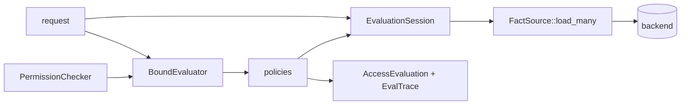
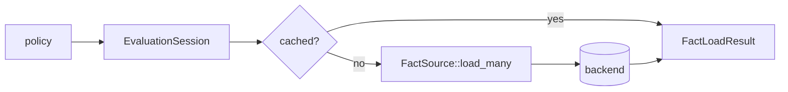

# Gatehouse

[](https://github.com/thepartly/gatehouse/actions/workflows/ci.yml) [](https://crates.io/crates/gatehouse) [](https://docs.rs/gatehouse)

An in-process authorization engine for Rust. Gatehouse keeps policy logic in Rust while giving each request an `EvaluationSession` for relationship and backend-loaded facts. Sessions batch, deduplicate, cache, and coalesce fact loads, so list endpoints can stay policy-correct without pushing authorization logic into the data layer.


## Features

- **Typed authorization domains**: Define one `PolicyDomain` per authorization domain and keep subject, action, resource, and context types consistent.
- **Request-bound evaluation**: Bind session, subject, action, and context once, then check one resource or evaluate, strictly filter, and page through resources.
- **RBAC, ReBAC, and predicate policies**: Use `RbacPolicy`, `RebacPolicy`, or synchronous `PolicyBuilder::when` predicates.
- **Deny-overrides semantics**: `VetoPolicy` and `VetoResult` keep veto authority separate from grant policies; atomic delegation preserves both capabilities.
- **Batch-safe list endpoints**: Authorize already-loaded resources or enumerate candidate IDs with `LookupSource` and `Hydrator`.
- **Evaluation traces and telemetry**: Inspect the policies and fact provenance that were actually evaluated.

This README describes the unreleased 0.6 API. For migration from the published 0.5.1 release, see [MIGRATION.md](MIGRATION.md).

## Cargo features

`tracing` is enabled by default and emits spans and security-rule events, including contract-violation warnings. Set `default-features = false` on the dependency to remove instrumentation and its dependency. Decisions, returned evaluation traces, and recorded fact provenance are unchanged; no telemetry events or warnings are emitted in that configuration. The independent `serde` feature enables serialization of public audit types.

## Quick Start

```rust
use gatehouse::*;

#[derive(Debug, Clone)]
struct User {
    id: u64,
    roles: Vec<&'static str>,
}

#[derive(Debug, Clone)]
struct Document {
    owner_id: u64,
}

#[derive(Debug, Clone)]
struct ReadAction;

struct Documents;
impl PolicyDomain for Documents {
    type Subject = User;
    type Action = ReadAction;
    type Resource = Document;
    type Context = ();
}

let admin_policy = PolicyBuilder::<Documents>::new("AdminOnly")
    .subjects(|user: &User| user.roles.contains(&"admin"))
    .build();

let owner_policy = PolicyBuilder::<Documents>::new("OwnerOnly")
    .when(|user: &User, _action: &ReadAction, doc: &Document, _ctx: &()| {
        user.id == doc.owner_id
    })
    .build();

let mut checker = PermissionChecker::<Documents>::new();
checker.add_policy(admin_policy);
checker.add_policy(owner_policy);

# tokio_test::block_on(async {
let session = EvaluationSession::empty();
let action = ReadAction;
let document = Document { owner_id: 7 };

let admin = User { id: 1, roles: vec!["admin"] };
let owner = User { id: 7, roles: vec!["user"] };
let guest = User { id: 2, roles: vec!["user"] };

assert!(checker.bind(&session, &admin, &action, &()).check(&document).await.is_granted());
assert!(checker.bind(&session, &owner, &action, &()).check(&document).await.is_granted());
assert!(!checker.bind(&session, &guest, &action, &()).check(&document).await.is_granted());
# });
```

Use `EvaluationSession::empty()` for fact-free checkers. When any policy reads facts through `ctx.fact(...)`, build a `FactRegistry` at application setup and create a fresh `registry.session()` for each request.

## Core Flow

Most call sites bind request-wide inputs once and evaluate one or more resources through the bound evaluator:

```rust,ignore
let session = registry.session();
let bound = checker.bind(&session, &subject, &action, &request_context);

let decision = bound.check(&resource).await;
let decisions = bound.evaluate(resources.clone()).await;
let authorized = bound.try_filter(resources).await?;
let authorized_rows = bound.try_filter_by(rows, |row| &row.authz_resource).await?;
let page = bound.try_lookup_page(&lookup, &hydrator, cursor.as_deref(), limit).await?;
```


```mermaid
flowchart LR
    Request[request] --> Session[EvaluationSession]
    Request --> Bound[BoundEvaluator]
    Checker[PermissionChecker] --> Bound
    Bound --> Policies[policies]
    Policies --> Session
    Session --> Facts[FactSource::load_many]
    Facts --> Backend[(backend)]
    Policies --> Decision[AccessEvaluation + EvalTrace]
```

`evaluate` / `evaluate_by` preserve input order and return each item with its complete decision. `try_filter` / `try_filter_by` return the original granted items, exclude definite denials, and fail if any final decision is indeterminate. `FilterError<Item>` retains all original items and decisions; its `indeterminate()` iterator selects unresolved items. The older `filter` / `filter_by` helpers intentionally omit outages as well as denials.

## Decisions and capabilities

`Policy<D>` returns `GrantResult`: grant, abstention, or indeterminate. `VetoPolicy<D>` returns `VetoResult`: veto, pass, or indeterminate. Register them with `add_policy` and `add_veto`, respectively. Typed results prevent a grant policy from accidentally returning veto authority or a veto policy from granting access.

The checker first resolves vetoes. A definite veto denies access even if another veto failed. Unresolved veto uncertainty blocks grants. Once vetoes pass, any grant authorizes; a failed grant policy does not defeat an independent grant. If nothing grants, uncertainty yields `AccessEvaluation::Indeterminate`; otherwise access is `Denied`. An empty checker denies access.

At application boundaries, use `evaluation.into_result()`. It returns `Ok(())`, `AccessError::Denied { reason, trace }`, or `AccessError::Indeterminate { reason, trace }`. Map denial to a forbidden response and indeterminate to an appropriate service error. Both the evaluation and typed error expose `fact_load_errors()` with structured `FactProvenance::error_kind`. An error recorded on an otherwise successful decision need not be its cause; classify the final decision first.

```rust
use gatehouse::{AccessError, AccessEvaluation, EvalTrace};

fn http_status(evaluation: AccessEvaluation) -> u16 {
    match evaluation.into_result() {
        Ok(()) => 200,
        Err(AccessError::Denied { .. }) => 403,
        Err(_) => 503,
    }
}
assert_eq!(http_status(AccessEvaluation::Indeterminate {
    reason: "authorization input unavailable".into(),
    trace: EvalTrace::new(),
}), 503);
```

`PolicyEvalResult` is the audit tree, accessed through `GrantResult::trace`, `VetoResult::trace`, or the final `EvalTrace`. It is not a policy return type. Its public nodes support inspection and serialization; arbitrary raw trees cannot be converted into typed policy results.

Fact-backed policies use `ctx.fact(key)` / `ctx.facts(keys)` and batch `ctx.facts_by(key_of)` / `ctx.fact(shared_key)`. These record successful, missing, and failed facts automatically. Recorded failures upgrade abstention or veto pass to indeterminate; decisive grants and vetoes remain decisive. Aggregate nodes retain their own provenance, with child evidence on child nodes. The same rules apply to leaves and aggregates.

When calling policies directly, finish their contexts with `ctx.finish(result)` or `batch_ctx.finish(results)` to attach remaining evidence. The checker and built-in combinators do this for you. `ctx.session()` bypasses recording; `ctx.record(FactProvenance::from_load_result(...))` records externally loaded facts. Backend diagnostics belong in internal traces, not client-facing response bodies.

## Policy Domains

A `PolicyDomain` names the four types involved in one authorization domain:

```rust
use gatehouse::PolicyDomain;

# struct User;
# struct DocAction;
# struct Document;
# struct RequestContext;
struct Documents;

impl PolicyDomain for Documents {
    type Subject = User;
    type Action = DocAction;
    type Resource = Document;
    type Context = RequestContext;
}
```

The generic parameter then stays short and consistent:

```rust,ignore
let policy = PolicyBuilder::<Documents>::new("Owner")
    .when(|user, _action, doc, _ctx| user.id == doc.owner_id)
    .build();

let checker = PermissionChecker::<Documents>::new();
```

## PolicyBuilder

Use `PolicyBuilder` for synchronous predicate logic:

```rust,ignore
let suspended_account = PolicyBuilder::<Documents>::new("SuspendedAccount")
    .when(|user, _action, _doc, _ctx| user.is_suspended)
    .build_veto();
checker.add_veto(suspended_account);
```

Implement `Policy<D>` for asynchronous grants or `VetoPolicy<D>` for asynchronous vetoes. Both support custom batching and security-rule metadata.

```rust
use async_trait::async_trait;
use gatehouse::{EvalCtx, Policy, PolicyDomain, GrantResult};
use std::borrow::Cow;

# #[derive(Debug, Clone)]
# struct User { id: u64 }
# #[derive(Debug, Clone)]
# struct Document { owner_id: u64 }
# #[derive(Debug, Clone)]
# struct ReadAction;
# struct Documents;
# impl PolicyDomain for Documents {
#     type Subject = User;
#     type Action = ReadAction;
#     type Resource = Document;
#     type Context = ();
# }
struct OwnerPolicy;

#[async_trait]
impl Policy<Documents> for OwnerPolicy {
    async fn evaluate(&self, ctx: &EvalCtx<'_, Documents>) -> GrantResult {
        if ctx.subject.id == ctx.resource.owner_id {
            ctx.grant("subject owns the document")
        } else {
            ctx.not_applicable("subject does not own the document")
        }
    }

    fn policy_type(&self) -> Cow<'static, str> {
        Cow::Borrowed("OwnerPolicy")
    }
}
```

## Built-In Policies

- `RbacPolicy`: role-based access control. Grants when at least one required role for `(action, resource)` is present in the subject's roles.
- `RebacPolicy`: relationship-based access control. Extracts subject/resource IDs, builds `RelationshipQuery` keys, and grants when the request session loads `Found(true)` from a registered `FactSource`.
- `DelegatingPolicy`: maps inputs into another `PolicyDomain` and delegates to a child `PermissionChecker`. Register it once with `add_delegate` to install both grant and veto capabilities. Child grant failures do not become veto failures; batching and nested evidence are preserved.

Use `PolicyBuilder::when` for attribute-style predicates that compare subject, action, resource, and context in one closure.

## Fluent Combinators

Policies can be composed with the `PolicyExt` helpers:

```rust,ignore
use gatehouse::PolicyExt;

let rule = is_editor.and(not_locked.not()).or(admin_override);
checker.add_policy(rule);
```

`AndPolicy::try_new` and `OrPolicy::try_new` build grant combinators from nonempty dynamic collections. `not()` inverts grants and abstentions while retaining uncertainty. For a local exclusion, use `grant.and(blocked.not())` with an ordinary predicate grant for `blocked`.

Vetoes cannot be mixed into grant combinators. Use `AllOfVeto` / `VetoPolicyExt::all_of` when every child must veto, or `AnyOfVeto` / `VetoPolicyExt::any_of` when any child veto suffices. In an all-of veto, a definite pass settles the result; in an any-of veto, a definite veto settles it. Otherwise uncertainty remains indeterminate. There is no veto negation.

For custom grant aggregates, `GrantResult::all` / `any` compute the decision from typed children. Empty result collections abstain; policy combinators reject empty collections.

## Request-Scoped Facts

`FactSource::load_many` receives unique keys and must return exactly one result per key in the same order. `EvaluationSession` expands duplicate caller inputs, preserves caller order, caches results for the request, chunks loads according to `FactSource::max_batch_size`, and joins concurrent in-flight loads for the same key.


```mermaid
flowchart LR
    Policy[policy] --> Session[EvaluationSession]
    Session --> Cache{cached?}
    Cache -- yes --> Result[FactLoadResult]
    Cache -- no --> Source[FactSource::load_many]
    Source --> Backend[(backend)]
    Backend --> Result
```

`RebacPolicy` is the built-in fact-backed policy. `Found(false)` and `Missing` abstain; missing sources, backend errors, and source contract violations produce indeterminate decisions.

Use typed relation enums when the domain has a fixed relation set, even if the backing store uses strings. The `FactSource` owns the backend boundary and can convert `Relation::Viewer` to `"viewer"` when binding SQL parameters.

## List Endpoints

For lists where the application already has candidate resources, use `BoundEvaluator::try_filter`:

```rust,ignore
let session = registry.session();
let visible_posts = checker
    .bind(&session, &user, &PostAction::View, &request_context)
    .try_filter(posts)
    .await?;
```

If each item is a wide row and the authorization resource is a projection, use the extractor variants:

```rust,ignore
let visible_rows = checker
    .bind(&session, &user, &InvoiceAction::View, &request_context)
    .try_filter_by(rows, |row| &row.authz_resource)
    .await?;
```

For lists where the candidate set is too large to load first, implement `LookupSource<Domain>` and `Hydrator<Id>`:

```rust,ignore
let page = checker
    .bind(&session, &user, &PostAction::View, &request_context)
    .try_lookup_page(&lookup, &hydrator, cursor.as_deref(), limit)
    .await?;
```

A `LookupSource` must enumerate a superset of every resource that any policy could grant for the bound subject/action/context. Lookup narrows candidates; it does not replace the policy stack.

`try_lookup_page` distinguishes source errors, hydration errors, contract violations, and indeterminate evaluations. An evaluation error retains every hydrated resource with its decision and returns no next cursor; retry the same input cursor with a fresh session after recovery. It never returns an incomplete authorized page as success because of an authorization outage. An atomic response spanning several pages must collect them before sending any output.

## Long-Lived Streams

`EvaluationSession` caches are scoped to one authorization pass. For SSE, WebSocket, and other long-lived streams, do not keep one fact-backed session for the stream lifetime.

If your product contract authorizes once at stream open, create a fresh session, compute the visible ID set with `try_filter` / `try_filter_by`, drop the session, and only emit frames for that set. If the stream must observe mid-stream permission revocation, run periodic reauthorization with a fresh `registry.session()` each tick and re-bind the checker for that pass.

## Tracing And Telemetry

When trace-level events are enabled, checker evaluation records spans for single-resource and batch evaluation, and each evaluated policy records a `trace!` event on the `gatehouse::security` target. Batch evaluation records aggregate item counts and nested `gatehouse.batch_policy` spans with per-policy counts.

Reason strings are emitted verbatim. Keep credentials, tokens, raw PII, and other sensitive material out of policy reasons and fact provenance details. Enable the optional `serde` feature to serialize `AccessEvaluation`, `EvalTrace`, `PolicyEvalResult`, and fact provenance for audit logs.

Security event fields:

- `security_rule.name`
- `security_rule.category`
- `security_rule.description`
- `security_rule.reference`
- `security_rule.ruleset.name`
- `security_rule.uuid`
- `security_rule.version`
- `security_rule.license`
- `event.outcome`
- `policy.type`
- `policy.result.reason`

## Examples

Run a self-contained example with:

```shell
cargo run --example rbac_policy
```

Run a server example with:

```shell
cargo run --example axum
```

Then send requests to `http://127.0.0.1:8000`; `actix_web` listens on `http://127.0.0.1:8080`.

Examples to start with:

- `rbac_policy`: basic role-based access control.
- `policy_builder`: attribute-style custom policies.
- `combinator_policy`: fluent `and` / `or` / `not` composition.
- `deny_override`: global veto policies with `PolicyBuilder::build_veto()`.
- `delegating_policy`: cross-domain checks with `DelegatingPolicy`.
- `mfa_freshness_context`: request-scoped context inputs.
- `rebac_policy`: relationship checks through `FactSource`.
- `in_ram_rebac`: in-memory relationship facts and session caching.
- `lookup_in_ram`: `LookupSource` plus `Hydrator` list authorization.
- `factsource_n_plus_one`: why request-scoped facts matter for list endpoints.
- `axum` and `actix_web`: web-framework integration.
- `postgres_bulk_rebac`: SQL-backed ReBAC fact loading.

## Performance

Criterion benchmarks in `benches/permission_checker.rs` exercise bound checker evaluation, fact loading, batching, and policy-builder batch shortcuts. Run them with:

```shell
cargo bench
```

The `postgres_bulk_rebac` example demonstrates a SQL-backed ReBAC `FactSource` with one batched `WITH ORDINALITY` query per request. It expects a live PostgreSQL database and reads `DATABASE_URL`.
